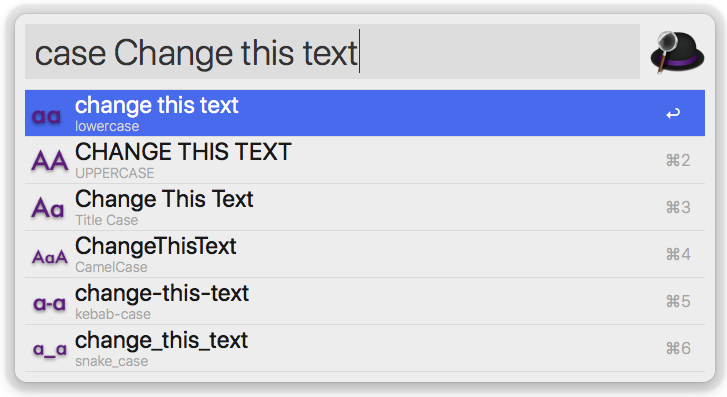

# Change Case — Workflow for Arvis

Changes the case of text selected, provided, or on the clipboard to UPPERCASE, lowercase, Title Case, CamelCase, kebab-case, or snake_case.

## 🔗 This workflow is converted from [alfred-workflow](https://github.com/gillibrand/alfred-change-case).

* Note that there might be some code change or different actions from the original workflow.

* Marked original workflow's creator to author.

## Install

Download and double click `arvisworkflow` file

## Usage

Change the case of text on the keyboard with the keyword `case`. All six styles are previewed as Arvis results. Select one to copy it to the clipboard and paste into in the current application.

Optionally, any text typed after `case` will be changed instead of the clipboard.

## Credits

- Workflow by Jay Gillibrand.
- `titlecase` module by [Stuart Colville](http://muffinresearch.co.uk).
- `CamelCase`, `kebab-case`, and `snake_case` additions added by [Ben Wagner](https://blizzrdof77.com)
